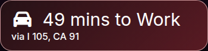

# 🌙 MagicMirror Home DashCalendar  
*A warm, home-friendly MagicMirror² - intended to be a home calendar like many we see on the market*


---

## ✨ Overview

**MagicMirror Home DashCalendar** is a curated MagicMirror² setup bundle designed for a central home calendar.

This came about as my wife and I both got tons of ads for subscription-supported hardware that aims to essentially do this function, but for way more upfront and recurring cost. The purpose of this repo is to help generate my personal MagicMirror layout for someone who was looking for a solution like mine, even if they are relatively new to MagicMirror.

It includes:

- 📅 A nice monthly Calendar view by [kolbyjack](https://github.com/kolbyjack/MMM-MonthlyCalendar) (can switch between current month or rolling 4 weeks) 
- 🌤️ Weather & forecast by [KristjanESPERANTO](https://github.com/KristjanESPERANTO/MMM-OneCallWeather) (via OpenWeather OneCall API)
- 🖼️ Photo frame style slideshow (powered by kolbyjack's [MMM-Wallpaper](https://github.com/kolbyjack/MMM-Wallpaper))  
- 🕒 Easy to read clock design (built in Clock module)
- 👁️ Optional PIR / MQTT motion-based screen control by [rkorell](https://github.com/rkorell/MMM-PresenceScreenControl)
- 🚗 Travel Time module by [saml-dev](https://github.com/saml-dev/MMM-Traffic)
- 🏠 Optional Home Assistant integration by [ambarusa](https://github.com/ambarusa/MMM-HomeAssistant)
- 🎨 Theme engine (Purple, Blue, Teal, Green, Red, Grey)  
- 🧩 Guided setup script that generates config.js + custom.css  
- 💡 Warm, living-room-friendly dark styling

This is **not** a single MagicMirror module.  
It is a **setup toolkit** that installs modules, configures your mirror, applies a theme, and writes:

```
~/MagicMirror/config/config.js
~/MagicMirror/css/custom.css
```

All based on your answers during setup.

You *need* to have MagicMirror installed already on your device. You can find that at the official repo [here](https://github.com/MagicMirrorOrg/MagicMirror), or use sdetweil's install script found [here](https://github.com/sdetweil/MagicMirror_scripts) (thanks, sdetweil!)

I installed MagicMirror on my Raspberry Pi 3b+ in my use case. A side note, the 3b+ requires you to use Raspberry Pi OS Bullseye due to some WiFi bug as of the time I wrote this. You do need the desktop version, Lite will not work. I'm not sure if the 4 or 5 run into this WiFi issue, however. YMMV.

---

## 🗂️ Included Modules

The scripted installer automatically installs & configures:

- **[MMM-MonthlyCalendar](https://github.com/kolbyjack/MMM-MonthlyCalendar)** – Clean monthly/4-week calendar  
- **[MMM-OneCallWeather](https://github.com/KristjanESPERANTO/MMM-OneCallWeather)** – Weather & forecast  
- **[MMM-Wallpaper](https://github.com/kolbyjack/MMM-Wallpaper)** – Photos / artwork slideshow  
- **[MMM-Remote-Control](https://github.com/Jopyth/MMM-Remote-Control)** – Remote browser UI / API  
- **[MMM-Traffic](https://github.com/saml-dev/MMM-Traffic)** - Travel time  
- **[MMM-PresenceScreenControl](https://github.com/rkorell/MMM-PresenceScreenControl)** (optional) – PIR / MQTT / CEC / xrandr automation  
- **[MMM-HomeAssistant](https://github.com/ambarusa/MMM-HomeAssistant)** (optional) – HA through MQTT autodiscovery  

---

## 🎨 Themes Included

You can select a theme during setup:

| Number | Theme | Preview |
|--------|--------|--------|
| 1 | Purple (default) ||
| 2 | Blue ||
| 3 | Teal ||
| 4 | Green ||
| 5 | Red ||
| 6 | Grey ||
| 7 | Amber/Gold ||

All themes are generally a dark-mode style with accent colors that aim to model how modern smartphones are.

---

## 🚀 Quick Install (easy mode)

Run this on your Raspberry Pi (with MagicMirror installed at `~/MagicMirror`):

```bash
bash <(curl -fsSL https://raw.githubusercontent.com/unnusl/magicmirror-home-dashcalendar/main/install.sh)
```

This will:

- Clone/update the repo  
- Install all required MagicMirror modules  
- Ask you setup questions  
- Build your theme  
- Generate `config.js` and `custom.css`  

Then start MagicMirror:

```bash
cd ~/MagicMirror
npm start
```

---

## 🛠️ Manual Install (advanced)

```bash
cd ~
git clone https://github.com/unnusl/magicmirror-home-dashcalendar.git
cd magicmirror-home-dashcalendar
chmod +x setup-mirror.sh
./setup-mirror.sh
```

---

## ❓ What the Setup Script Asks You

### 1. Theme Selection  
Choose from the included color schemes (purple is my favorite and is the default).

---

### 2. Presence Mode  
Choose:

1. **PIR only** (intended for using an IR sensor plugged into a Raspberry Pi's built in GPIO pins)
2. **PIR + MQTT**  (lets you combine onboard PIR motion detection with more advanced automation via MQTT)
3. **No sensor (always on)** (if you want to keep the screen on all the time)

If a presence mode is enabled, you'll also configure:

- HDMI-CEC / xrandr / none  (how to control timeout, whether CEC command or just turning the output on HDMI off, etc)
- Optional xscreensaver integration  (I love xscreensaver with the Cloud Life screensaver)
- Timeout (seconds before screen off / saver)

---

### 3. Other Modules  

Toggle these:

- **MMM-Traffic**
  - It will ask you in the format Long,Lat rather than Lat,Long -- for example: -117.918985,33.812136 for Disneyland.
    - If you need to get your coordinates, you can get those by right clicking on your location in Google Maps. Remember, Maps will display them in LAT,LONG. This module requires the inverse.
  - It will also require an API Key from MapBox. Instructions can be found at the [MMM-Traffic repo](https://github.com/saml-dev/MMM-Traffic?tab=readme-ov-file#mapbox-access-token).
- **MMM-HomeAssistant**
  - This will help you get advanced controls via HomeAssistant 

---

### 4. Weather Inputs  

Enter:

- Latitude  (eg Disneyland is 33.812136)
  - Coordinates can be found on Google Maps if you right click on your location.
- Longitude  (eg Disneyland is -117.918985)
- OpenWeather API key
  - Free tier is fine, you will not be querying nearly as much as the limit. You can get that [here](https://openweathermap.org/api)

---

### 5. Calendars  

Add 1–3 calendar URLs:

- iCloud shared calendar links  
- Google Calendar private ICS links  
- Any webcal/https source  

Choose calendar mode:

- **Current month (default)**  
- **Rolling 4 weeks**

---

### 6. Wallpaper (MMM-Wallpaper)

Choose from 17+ sources:

- iCloud shared album  
- Bing daily  
- Local folder  
- Reddit (subreddits / multireddits)  
- FireTV / Chromecast  
- NASA APOD / HD / NASA image search  
- Flickr API  
- MetMuseum art  
- Lightroom album  
- Synology Moments  
- URL  
- Custom string  
- Google Photos **via local sync folder** (recommended workaround)

Also set the slide interval (default 15 seconds).

---

### 7. Optional Traffic Module

If enabled:

- Mapbox token  
- Origin coords  
- Destination coords  
- Destination label  

---

## 📁 File Outputs

After the script finishes:

```
~/MagicMirror/config/config.js       ← fully generated
~/MagicMirror/css/custom.css         ← your chosen theme
```

Old configs are automatically backed up:

```
config.js.bak.<timestamp>
```

---

## 🧱 Folder Structure

```
magicmirror-home-dashcalendar/
├─ install.sh
├─ setup-mirror.sh
├─ config.template.js
├─ themes/
│  └─ custom.css.template
├─ .gitignore
└─ README.md
```

---

## 🔄 Updating / Re-running

If you update the repo on GitHub and want to re-run the installer:

```bash
bash <(curl -fsSL https://raw.githubusercontent.com/unnusl/magicmirror-home-dashcalendar/main/install.sh)
```

It will:

- Pull latest changes  
- Re-run the guided setup  
- Regenerate config & CSS  

---

## 🐛 Troubleshooting

### MagicMirror doesn't start?

Check logs:

```bash
cd ~/MagicMirror
npm start
```

Or with pm2:

```bash
pm2 logs MagicMirror
```

---

## 🧩 Contributing

Pull requests welcome!  
Good opportunities:

- New themes  
- Additional wallpaper presets  
- More module compatibility  
- Better layout responsiveness  
- Presence / screen automation improvements  

---

## 📜 License: MIT

This project is released under the MIT License, meaning:

- Free to use  
- Free to modify  
- Free to redistribute  
- Credit required  
- No liability  

Ideal for MagicMirror community projects.

---

## ❤️ Enjoy Your Home Dashboard

This project was designed to feel **warm, cozy, and home-friendly**, not sterile.  
If you make cool customizations, submit a PR or share screenshots!
